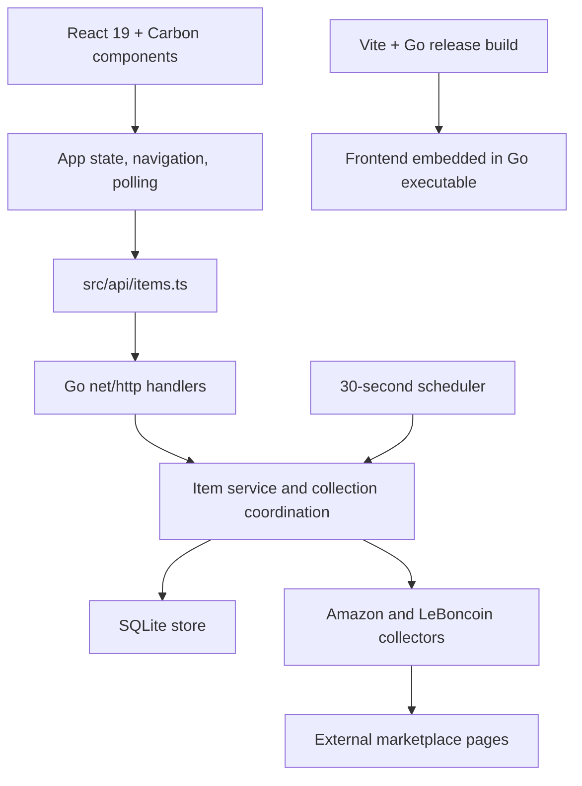

# Architecture and TDD readiness assessment

Assessment date: 2026-10-03 (Europe/Paris). Source revision: `96659124067b0fd6314ec815a075d4becdb3ec9e`.
Scope: assess the current application and prepare a testing plan. This report does not implement test infrastructure or authorize refactoring. The user's requested first deliverable is this assessment before testing the application comprehensively.

## Conclusion

TDD can start directly for many parts of this application. A broad architectural refactor is unnecessary. Go already has its test runner and useful test boundaries; React needs committed testing tools and configuration. Comprehensive, deterministic coverage will need reusable fixtures and controlled network/time/concurrency behavior. Introduce a small production seam only where a concrete test demonstrates that existing boundaries are insufficient.

Tests written around existing behavior are characterization/regression tests. TDD applies prospectively: write a failing test for a specified missing behavior or confirmed defect, make the smallest approved implementation change, then refactor with tests green. Do not rewrite working code merely to manufacture a failing test, and do not freeze an existing bug into a requirement.

“Test everything” should mean traceable coverage of approved behavior, critical failure paths and boundaries across all layers. It cannot mean proof of every possible input, every third-party page, or a guarantee implied by 100% line coverage.

## Current architecture

| Area | Actual organization and responsibility | Test implications |
| --- | --- | --- |
| Bootstrap/configuration | `cmd/pricefollower/main.go` wires configuration, SQLite, service, scheduler, HTTP server and shutdown; `config/config.go` reads environment. | Environment/config tests are direct; startup/shutdown and embedded assets also need process/release smoke checks. |
| Frontend | `src/App.tsx` owns fetching, five-second list polling, three-second detail polling, mutations and History API navigation. `src/components/` holds list, detail, modals and status presentation. | Props/callbacks and centralized fetching already provide useful boundaries. Actual layout/accessibility still require a browser. |
| API adapter | `src/api/items.ts` maps integer API cents to display amounts, nullable offers/history and consistent request errors. | Test exported operations through controlled fetch responses; private mapping functions need not be exported. |
| HTTP API | `internal/httpapi/server.go:20` holds a concrete service; `Handler()` at line 35 exposes an ordinary handler. It validates requests, maps errors, and serves embedded assets. | Read/validation routes can be tested now; successful add/refresh tests need isolated collection behavior to avoid live requests. |
| Service | `internal/service/service.go:30` already defines a small collector interface; service owns platform collectors, in-flight state, workers and refresh slots. | Same-package tests can substitute collectors before workers start. Real temp SQLite is preferable to a broad mocked repository layer. |
| Persistence | `internal/store/store.go:25` opens a database in configurable `DataDirectory`, enables foreign keys/WAL and uses one connection. It stores attempts, observations, offer history, schedules and schema evolution. | Temp-directory databases enable realistic integration tests immediately. State derivation and data integrity deserve boundary tests. |
| Collectors | `internal/amazon/collector.go:67` and `internal/leboncoin/collector.go:55` hold HTTP clients; parsing helpers interpret URLs and response content. | Same-package tests can replace transports while preserving request URLs; local sanitized HTML/JSON fixtures avoid live marketplaces. |
| Deployment | Four Bash scripts build/embed, copy, install and coordinate ARMv6 deployment. Installer writes fixed system paths and manages systemd. | Command stubs safely verify orchestration. Actual installer/systemd/device behavior needs a disposable suitable environment. |

The intended Go layer separation exists. The frontend uses `src/components/` and `src/api/`, rather than the illustrative feature-folder tree in the architecture skill; this is an established layout, not a reason to reorganize. Older skill context describes Amazon-only v1, whereas the approved API and actual code also support LeBoncoin and full histories. Tests must follow the current approved contract and functional specifications.

## Verified baseline and gaps

- Executed `go test ./...`: exit 0, **all nine packages report `[no test files]`**. This establishes compilation of the packages, not behavioral coverage.
- Tracked-file inventory found no Go tests, frontend test files, committed executable test harnesses or GitHub Actions configuration. `package.json` has no test script or test dependencies.
- Historical reports record eight frontend fixture QA groups and 43 deployment CLI cases. Their harnesses remain under `/tmp`, outside Git; a clean checkout cannot run them as a project suite.
- The temporary browser harness catches case failures into its results but does not fail the final process for recorded failures (`/tmp/pricefollower-ui-qa/identity-qa.cjs:29`, `:40`). The CLI harness likewise prints failed flags without a failing exit (`/tmp/armv6-qa.py:56`). Those reports were manually inspected previously; exit zero alone is insufficient for a durable gate.
- Installed runtime: Node `v20.19.2`; project manifest requires Node `>=22`. Installed Vite is `6.4.3`. Fix this environment mismatch before establishing the frontend test baseline. Current Vitest documentation requires Node `>=22.12.0` and Vite `>=6.4.0`; pin compatible tooling instead of assuming any latest version fits. [Vitest setup](https://vitest.dev/guide/).
- No numerical coverage result is available. A successful build, historical QA count, and absence of test files must not be reported as measured coverage percentages.

## Can TDD be applied directly?

| Area | Start without production refactoring? | Preparation or boundary to verify |
| --- | --- | --- |
| Configuration, URL and price parsing | Yes | Standard Go tests, environment reset and table-driven fixtures. |
| SQLite CRUD/history/constraints/migrations | Yes | Fresh temp database per test, explicit timestamps, reopen checks and cleanup. Never use `.data` or production data. |
| Scheduling calculation | Yes | `NextCheckAt(after)` already accepts time; include exact slot, next day and Europe/Paris DST cases. |
| Collector response handling | Yes, in package-local tests | Replace each client's transport, inspect requests, provide deterministic response bodies/errors and close bodies. No live network. |
| Service rules and concurrency | Largely yes | Existing collector interface/map, channels and temporary SQLite. Test cancellation/deduplication without arbitrary sleep-based assertions. |
| HTTP contract integration | Partly | `httptest` can invoke `Handler()` directly. To cover successful add/refresh through the real service offline, first choose a small supported way to supply controlled collectors across package boundaries. |
| Frontend components/API/App | Yes after tooling setup | DOM runner, React Testing Library, fetch/module mocks, fake timers, reset browser history, controlled promises and required Carbon browser APIs. No router/state-library/hook extraction is necessary upfront. |
| Browser journeys | Yes after committed setup | Portable browser configuration, fixed fixtures and automatic server startup; a smaller real-backend smoke layer. |
| Bash orchestration | Yes | Commit isolated command fixtures and make any failed case fail the process. |
| Real ARMv6/systemd deployment | Not established by local unit tests | Disposable device/VM or appropriate emulation, privileges and representative database. This needs a separate integration environment. |

Go's standard `httptest` supports handler and HTTP testing. React Testing Library supports testing components through their rendered interface. [Go httptest](https://pkg.go.dev/net/http/httptest), [React Testing Library](https://testing-library.com/docs/react-testing-library/intro/).

## Prerequisites, in order

1. **Establish the test baseline.** Use a supported Node runtime; add pinned frontend test dependencies, configuration and local commands; add Go package tests. Add fixture builders and ensure an intentionally failing test makes every runner return nonzero. This is tooling/test work, not an application architecture refactor.
2. **Create characterization tests before changing existing code.** Start with URL validation, cents/history mapping, SQLite price periods and CRUD, list/detail/search/modal behavior. Derive expectations from `API_SPECIFICATION.md`, functional specifications and use cases; record disagreements for product decisions.
3. **Control dependencies for the next difficult tests.** Use the existing collector interface and per-client transport in package tests. For real-service API integration, a narrowly scoped constructor option or dependency parameter for collectors may be appropriate. Keep default production wiring identical; do not introduce generic dependency-injection infrastructure or interfaces for every store operation.
4. **Make time tests deterministic where needed.** Direct `time.Now`, `time.Since`, the 30-second ticker and randomized 5–60-second waits appear in `service.go:262–315` and `store.go:534–548`. Go 1.25 already provides `testing/synctest` fake time; the local toolchain documentation was checked. Try it and synchronization channels first. Its fake-time blocking rules must not be assumed to virtualize real filesystem/network I/O. A small `now`/wait hook or timestamp parameter is a targeted fallback, only if tests show it is needed.
5. **Promote repeatable CLI/browser tests.** Correct failure exit behavior; remove machine-specific executable/port assumptions; isolate each scenario and restore timers/mocks; retain fixture inputs and cleanup. Do not copy the temporary harnesses unchanged into CI.
6. **Add regression gates and the TDD cycle to development.** Proposed commands: `go test ./...`, native `go test -race ./...` where supported, frontend tests/coverage, focused browser journeys and Bash fixture checks. Keep cross-compilation and real-device tests separate from native race testing. Run one representative RED → GREEN → REFACTOR change, then expand by feature risk.

**Refactoring decision:** no broad refactor is required before starting. Recommend setup and characterization first; defer constructor/time hooks until a concrete test needs them. The user chooses the timing of those production changes under `AGENTS.md`. No such changes were made in this assessment. API confirmation is only needed if later work changes the contract, not simply because tests cover both tiers.

## Coverage plan for the whole application

| Subject | Required behavior and corner cases |
| --- | --- |
| Configuration/startup | Defaults, invalid ports/timezones/check times, isolated directories, orderly cancellation and database close. |
| URL/marketplace handling | Supported euro Amazon hosts/forms, LeBoncoin IDs/trailing comma, malformed/unsupported schemes, normalization and duplicate identities. |
| Collection | Valid price/zero/free versus absent price, localized formats, stale/unavailable/blocked responses, HTTP errors, redirects, cancellation/timeouts, Amazon seller attribution and offer condition/history. Use sanitized fixtures. |
| Store/history | Duplicate uniqueness, successful observation versus failed attempt, unchanged-price periods and return to prior price, latest-three versus full history, persistence after reopening, cascaded deletion and schema upgrades. |
| Service/scheduler | Immediate async add, single/bulk refresh and deduplication, pending state, concurrency limit, deletion during collection, cancellation, next-check persistence and DST. |
| HTTP contract | Every method/route, requests and response shape/nullability, integer cents, 201/202/204 semantics, invalid/multiple/oversized JSON, missing items, safe errors, headers and production SPA fallback. |
| Frontend | List/search, identity order, empty/loading/error/retry, price/offer states, add/duplicate/error flow, delete cancel/retry, details/full histories, both refresh controls, navigation, delayed/out-of-order responses, polling cleanup and StrictMode. |
| Browser/accessibility | Keyboard/focus, actual responsive layout, direct links and reload, modal behavior and both marketplace links. Retain seeded exploration alongside deterministic assertions. |
| Deployment | Input validation, ARM6 environment and embedded frontend, build/copy/install ordering, failure propagation, service-active check; separately verify actual systemd startup/update, reboot and database preservation on a disposable device. |

Acceptance is a requirement-to-test matrix with critical paths covered, reliable failing exit codes, repeatable offline runs and explicit integration limitations. Coverage reports help locate gaps; no arbitrary 100% target or guarantee is proposed.

## Candidate first RED test

Static inspection found a concrete contract risk: detail responses promise history arrays (`API_SPECIFICATION.md`, Item response fields), but `internal/model/model.go:29` and `:45` apply `omitempty`. The store initializes empty detail histories at `internal/store/store.go:434` and `:496`; Go JSON encoding omits empty slices under that tag. A fresh item could therefore omit arrays promised by the detail contract. This is a source-based finding, not an executed endpoint reproduction. A first failing HTTP serialization test should establish it while also confirming that list/add responses still omit histories. Resolve it with the smallest contract-preserving fix after the test is written; do not simply remove omission globally and change list behavior.

## Effort expressed in tokens and weekly allowance

A weekly percentage is **not currently calculable for this account**. No available tool exposes the account's weekly allowance/remaining usage, and the user has not provided it. Official documentation says included usage varies with model, context, reasoning, tools and caching; token credit rates do not directly determine subscription-limit consumption. The usage dashboard or CLI `/status` is the account source. [Official usage guidance](https://learn.chatgpt.com/docs/pricing).

For planning only, a deliberately coarse **allocation of 200,000–500,000 aggregate model tokens** for the full offline campaign is reasonable to reserve, including scoped context reading, generated tests, debugging, specialist review and QA. This is a low-confidence engineering estimate, not measured consumption, a guarantee, or a subscription conversion. It assumes focused agent handoffs rather than repeatedly replaying this entire conversation, no large application rewrite and no extended real-device troubleshooting. Token use may exceed it if defects expand scope. It excludes this assessment and cannot represent wall-clock time.

| Future work package | Provisional token allocation |
| --- | ---: |
| Test tooling, deterministic fixtures, first representative slice and any narrowly justified seam | 40,000–100,000 |
| Go parser/store/service/HTTP tests and regression fixes within approved scope | 75,000–180,000 |
| Frontend API/component/App lifecycle tests | 45,000–115,000 |
| Durable CLI/browser checks, integration smoke, gates, review and final verification | 40,000–105,000 |
| **Full offline campaign, including preparation** | **200,000–500,000** |

If an actual raw-token weekly allowance `W` is available and uses the same accounting unit, preparation would be `100 × [40,000, 100,000] / W` percent and the full campaign `100 × [200,000, 500,000] / W` percent. For a purely illustrative `W = 1,000,000` tokens, those are **4–10%** and **20–50%**. This example is not the user's allowance. For remaining tokens `R`, divide by `R` instead; that is a percentage of the remaining balance, not the full week.

If the account shows only a remaining percentage, plan name or credits, it does not provide a raw-token denominator. Do not convert the example into a claimed weekly cost. Calibrate one small representative test slice against the same account/model/speed usage meter before estimating subscription percentage; other concurrent usage and resets must be excluded. That first slice is included in preparation, not an extra full campaign.

The next decision is whether to proceed with test setup and characterization first, with targeted production seams proposed only when needed. A weekly percentage remains pending account data and an applicable usage conversion/calibration.
